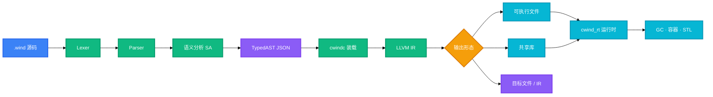

<h1 align="center">CWind</h1>
<p align="center">
  <strong>面向系统编程的静态强类型语言, 经 LLVM 编译为原生代码</strong>
  <br />
  <em> 更简单的 Rust · AOP 钩子 · 精化类型 · 精确 GC </em>
</p>

<p align="center">
  <a href="#III-快速开始"></a>
  <a href="LICENSE"></a>
</p>

<p align="center">
  
  
  
  
  
  
</p>

---

> 此项目仍处于且将长期处于原型阶段, 不保证 API / ABI 稳定性
> 
> 仅保证 Windows 下正常构建, 其余平台不定期测试维护

---

## 0. ToC

- [0. ToC](#0-toc)
- [I. 定位](#i-定位)
- [II. 功能特性](#ii-功能特性)
  - [2.1 差异对比](#21-差异对比)
- [III. 快速开始](#iii-快速开始)
  - [3.1 环境要求](#31-环境要求)
  - [3.2 构建](#32-构建)
  - [3.3 安装前端](#33-安装前端)
  - [你好, 世界!](#你好-世界)
- [IV. 新功能概览](#iv-新功能概览)
  - [4.1 精化类型](#41-精化类型)
  - [4.2 AOP 钩子](#42-aop-钩子)
  - [4.3 CFFI](#43-cffi)
    - [4.3.1 link 属性参数表](#431-link-属性参数表)
    - [4.3.2 用法示例](#432-用法示例)
  - [4.4 编译为链接库](#44-编译为链接库)
  - [4.5 常用命令](#45-常用命令)
  - [4.6 整程序项目](#46-整程序项目)
- [V. 架构](#v-架构)
- [VI. 性能](#vi-性能)
- [VII. 项目结构](#vii-项目结构)
- [VIII. 相关项目](#viii-相关项目)
- [IX. 待办事项与漏洞追踪](#ix-待办事项与漏洞追踪)
- [X. 许可证](#x-许可证)

---

## I. 定位

自带 AOP 钩子, 精化类型, 同 crate 过程宏与精确 GC; 语法上借鉴 Rust (所有权, trait, 泛型, `macro_rules!`) , 实现为两段式管线

数值类型一律使用短写 (`i8`...`i64`, `u8`...`u64`, `f32` / `f64`, `usize` / `isize`, 别名定义见 [`libs/builtins`](https://github.com/starwindv/cwind-lang/blob/main/libs/builtins/mod.wind))

---

## II. 功能特性

### 2.1 差异对比

下表为 CWind 相对 Rust 做出的部分修改

|          | macro-rules | derive | 函数式过程宏 | 属性宏 | let 定义变量类型自动推断 | 尾返回无需 return | 带值枚举 | CFFI     | 借用检查器 | 生命周期标注 | trait 与 泛型 | 关联类型/常量 | 超 trait | 负 trait | 闭包 | match | `?` | 迭代器糖 | `move` | 异步 | 高层自建类型 | 自举 |
|----------|-------------|--------|--------------|--------|--------------------------|-------------------|----------|----------|------------|--------------|---------------|---------------|----------|----------|------|-------|-----|----------|--------|------|--------------|------|
| 保留     | ✅          | ✅     | ✅           | ✅     |                          | ✅                | ✅       | ✅       | ✅         |              | ✅            | ✅            | ✅       | ✅       | ✅   | ✅    | ✅  | ✅       |        |      |              |      |
| 说明     |             |        |              |        |                          |                   |          | 语法修改 |            | 有 GC        |               |               |          |          |      |       |     |          |        |      |              |      |
| 删除     |             |        |              |        |                          |                   |          |          |            | 🚫           |               |               |          |          |      |       |     |          |        |      |              |      |
| 尚未实现 |             |        |              |        | ⬜                       |                   |          |          |            |              |               |               |          |          |      |       |     |          | ⬜     | ⬜   | ⬜           | ⬜   |

---

## III. 快速开始

### 3.1 环境要求

- LLVM 18.x–23.x (Windows 置于仓库根 `.LLVM/`; Linux 直接使用系统 LLVM) 
- Python ≥ 3.13, CMake ≥ 4.x, Ninja 或 Make, gcc ≥ 15.x

### 3.2 构建

Windows (PowerShell, 仓库根目录): 

```powershell
New-Item -Path build -ItemType Directory
Set-Location build
cmake ../mvp -G Ninja -DCMAKE_C_STANDARD=11 -DCMAKE_C_FLAGS="-O3 -mavx2 -mfma -march=native -ffast-math -funroll-loops -fomit-frame-pointer -DNDEBUG"
ninja
```

Linux

```bash
mkdir -p build && cd build
cmake ../mvp -DCMAKE_C_STANDARD=11 -DCMAKE_C_COMPILER=gcc
make -j"$(nproc)"
```

注意, 我们并未测试在 Linux 上启用复杂优化时的行为是否正常

### 3.3 安装前端

```bash
python -m venv .venv
# Windows:
.venv\Scripts\pip install -e mvp/frontend
# Linux / macOS:
.venv/bin/pip install -e mvp/frontend
```

安装`cwind_frontend`后, 虚拟环境的`cwindf`即为编译器前端

后端为 `build/cwindc` (Windows 为 `build/cwindc.exe`) . 

### 你好, 世界!

保存为 `hello.wind`: 

```wind
fn main() {
    println!("Hello, World!");
}
```

```bash
cwindf --typed-ast hello.wind > hello.json
cwindc hello.json -o hello.exe
./hello.exe
```

---

## IV. 新功能概览

### 4.1 精化类型

```wind
type Age = i32 where {
    self > 0 && self < 150;
}

struct User {
    pub name: String,
    pub age: u32 -> {
        age >= 18;
    }
}

fn main() -> i32 {
    let age: Age = 25;
    println!("{}", age);
    // let bad: Age = 200; // 违反精化条件, 常量在编译期即被拒绝
    return 0;
}
```

---

### 4.2 AOP 钩子

```wind
struct Counter {
    value: i32,
}

extra Counter {
    fn bump(&mut self) -> i32 {
        self.value = self.value + 1;
        return self.value;
    }

    fn log(&self), after ::bump {
        println!("bumped");
    }
}

fn main() -> i32 {
    let mut c: Counter = Counter { 0 };
    c.bump();
    return 0;
}
```

---

### 4.3 CFFI

成员级 `#[link_name = "..."]` 用于 C 符号与 CWind 声明名不一致 (或撞关键字) 时重命名. 

#### 4.3.1 link 属性参数表

|      | name                            | kind                         | path               | relative                                             |
|------|---------------------------------|------------------------------|--------------------|------------------------------------------------------|
| 说明 | 指定目标库名称, 例如`m`表示libm | 链接类型, 分为`static/dylib` | 指定目标链接库路径 | 若`path`为相对路径, 则以此为锚点, 可选`source`/`cwd` |

#### 4.3.2 用法示例

```wind
#[link(name = "m")]
extern "C" {
    fn sqrt(x: f64) -> f64;
    fn pow(base: f64, exponent: f64) -> f64;
}

// 此 lib 在仓库测试内, 需要自行编译
#[link(name = "cwindmath", kind = "static", path = "./libcwindmath.a")]
extern "C" {
    #[link_name = "secret_add"]
    fn add(a: i32, b: i32) -> i32;
}

fn main() {
    let x: f64 = 16;
    println!("sqrt({}) = {}", x, sqrt(x));

    let base: f64 = 2;
    let exponent: f64 = 10;
    println!("pow({}, {}) = {}", base, exponent, pow(base, exponent));
}
```

部分 C 库绑定 (`stdio`/`stdlib`/`math`等) 见 [`libs/libcbind`](https://github.com/starwindv/cwind-lang/blob/main/libs/libcbind/)

带 `path` 直链动态库的完整程序用法见 [`example/project/mnist-gpu`](https://github.com/starwindv/cwind-lang/blob/main/example/project/mnist-gpu/)

---

### 4.4 编译为链接库

用 `#[export]` 标记导出面, 用`#[export(name = "...")]`改写符号名. 导出集合及其可达依赖会保留, 其余符号被 DCE.

共享库经 `cwindc --emit share` 生成, C 侧 `LoadLibrary` / `dlopen` 后按 C ABI 调用. 

(前端的`--emit share`只负责检查语法+是否出现违规main函数, 避免`前端全对, 后端报错`的问题)

```wind
#[export]
fn cw_add(a: i32, b: i32) -> i32 {
    return a + b;
}

#[export(name = "cw_greet")]
fn greet(name: String) -> String {
    return "hi " + name;
}
```

编译: 

```bash
cwindf lib.wind --emit share --typed-ast > lib.json
cwindc --emit share lib.json -o libcwind.dll
```

更多示例见 [`example/`](https://github.com/starwindv/cwind-lang/blob/main/example/). 

---

### 4.5 常用命令

| 命令                                                                        | 作用                                                        |
|-----------------------------------------------------------------------------|-------------------------------------------------------------|
| `cwindf file.wind`                                                          | 检测文件中的问题 (无错误则静默)                             |
| `cwindf --unparse file.json`                                                | 反编译生成的 Json (用于debug)                               |
| `cwindf --lex / --parse / --sa file.wind`                                   | 分阶段查看词法 / 语法 / 语义                                |
| `cwindf --typed-ast file.wind`                                              | 输出 TypedAST JSON                                          |
| `cwindf --project [DIR]`                                                    | 以 `Breeze.toml` 为锚点整程序编译, 产物在项目下的 `target/` |
| `cwindf --emit share --typed-ast lib.wind`                                  | 检验不该存在的`main`函数并输出 JSON                         |
| `cwindc prog.json -o out.exe`                                               | 生成可执行文件                                              |
| `cwindc prog.json`                                                          | 同上, 输出名取输入基名                                      |
| `cwindc --check prog.json`                                                  | 审计 TypedAST                                               |
| `cwindc --emit llvm prog.json`                                              | 输出 LLVM IR                                                |
| `cwindc -O3 --target-cpu native --lto fat --fast-math prog.json -o out.exe` | 优化构建                                                    |
| `cwindc --emit share prog.json -o lib.dll`                                  | 生成共享库 (反向 FFI)                                       |

### 4.6 整程序项目

`Breeze.toml` 声明包名与入口后: 

```bash
cwindf --project
cwindc target/project.json -o target/app.exe
```

完整样例 (含 FFI, `#[link]`, 命令行参数) 见 [`example/project/mnist-gpu`](https://github.com/starwindv/cwind-lang/blob/main/example/project/mnist-gpu/)

`cwindf` 另支持 `--target-os` / `--target-arch` / `--target-vendor` / `--target-pointer-width` 控制 `#[cfg]`. 

---

## V. 架构



前端负责宏展开, 降糖与语义标注; 后端只做 TypedAST 装载, codegen 与链接, 两侧以 RichJSON 契约解耦. 

---

## VI. 性能

仅检测了纯计算性能, 连续运行三次取均值, 使用 `time`(来自`scoop-main`) 得到运行时间: 

<table>
  <thead>
    <tr>
      <th></th>
      <th colspan="2">CWind</th>
      <th>Rust-1.98.1</th>
      <th>GCC-15.1.0</th>
      <th>Clang-23.1.1</th>
    </tr>
  </thead>
  <tbody>
    <tr>
      <td>Version</td>
      <td>2026/09/22, LLVM-23.1.1</td>
      <td>2026/09/22, LLVM-18.1.9</td>
      <td>1.98.1-stable, msvc</td>
      <td>15.1.0, msys2</td>
      <td>23.1.1, msvc</td>
    </tr>
    <tr>
      <td>fib42</td>
      <td>(0.5619330+0.5759612+0.5616252)/3=0.566506 sec</td>
      <td>(0.5678319+0.5624580+0.5612585)/3=0.563849 sec</td>
      <td>(0.6357034+0.6376320+0.6529572)/3=0.642098 sec</td>
      <td>(0.2862370+0.2837771+0.2803092)/3=0.283441 sec</td>
      <td>(0.5391794+0.5379792+0.5378969)/3=0.538352 sec</td>
    </tr>
    <tr>
      <td>bernoulli30</td>
      <td>(2.2190541+2.1831064+2.1857422)/3=2.195968 sec</td>
      <td>(2.0407849+2.0484132+2.0829733)/3=2.05739 sec</td>
      <td>(2.0190803+2.0013568+2.0066355)/3=2.009024 sec</td>
      <td>(1.2972779+1.2811154+1.2898034)/3=1.289399 sec</td>
      <td>(2.2995181+2.1969182+2.2247002)/3=2.240379 sec</td>
    </tr>
    <tr>
      <td>编译参数</td>
      <td>"-O3 --lto fat --target-cpu native --fast-math"</td>
      <td>同左</td>
      <td>"-C opt-level=3 -C target-cpu=native -C lto=fat -C codegen-units=1"</td>
      <td>"-O3 -mavx2 -mfma -march=native -ffast-math -funroll-loops -fomit-frame-pointer -DNDEBUG"</td>
      <td>同 GCC</td>
    </tr>
  </tbody>
</table>

同参数下 GCC 确实比 Clang 要激进很多, 不然很难理解为什么 GCC 碾压所有人了

---

## VII. 项目结构

```
cwind/
├── mvp/
│   ├── frontend/           # 前端编译器
│   ├── compiler/           # 后端编译器
│   ├── rt-src/             # 运行时
│   ├── test-c/             # C 单测与 pipeline fixtures
│   ├── fuzz/               # 语法 fuzzing
│   └── submodule/          # 存放用到的子模块
├── libs/                   # 临时标准库
├── example/                # 语言示例
├── bench/                  # 少量性能测试
└── assets/                 # 部分资源文件
```

---

## VIII. 相关项目

下列仓库均为 BSD-3-Clause: 

| 仓库                                                                    | 在本项目中的用途                                                                    |
|-------------------------------------------------------------------------|-------------------------------------------------------------------------------------|
| [CWind-Args-Parser](https://github.com/CWind-Project/CWind-Args-Parser) | `cwindc` 的命令行参数解析 (git submodule)                                           |
| [CWind-STL](https://github.com/CWind-Project/CWind-STL)                 | 后端常用数据结构与 TypedAST JSON 解析器 (header-only, 经 `rt-src/include/stl` 引入) |
| [tgqe-py](https://github.com/CWind-Project/tgqe-py)                     | 前端错误汇总总线 (`cwindf` 直接依赖)                                                |
| [ariadne-py](https://github.com/CWind-Project/ariadne-py)               | 编译器诊断渲染 (`tgqe-py` 的默认输出后端, 前端经 tgqe 使用)                         |
| [CWind-LSP](https://github.com/CWind-Project/CWind-LSP)                 | 语言服务器: 复用 `cwind_frontend` 提供高亮, 跳转, 补全与诊断                        |
| [CWind-Regex](https://github.com/CWind-Project/CWind-Regex)             | ECMAScript 正则引擎, 已实现几乎完整功能(除了v标签), 未接入                          |

---

## IX. 待办事项与漏洞追踪

见 [todo](https://github.com/starwindv/cwind-lang/blob/main/assets/todos.md)
和 [bugs](https://github.com/starwindv/cwind-lang/blob/main/assets/bugs.md)

---

## X. 许可证

本仓库与上方表格列出的相关项目均为 [BSD-3-Clause](LICENSE) 开源
